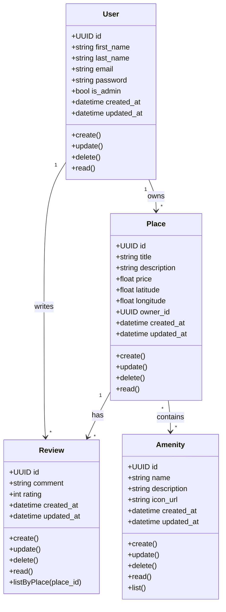

# Diagramme de Classes (Task 1)

## Vue d'ensemble

Ce diagramme montre les **classes principales** du système HBNB et leurs attributs/méthodes, représentant la structure des modèles métier.

## Diagramme



## Classes du système

### 📌 Classe User (Utilisateur)

#### Attributs
```
- id : UUID              → Identifiant unique de l'utilisateur
- first_name : string    → Prénom
- last_name : string     → Nom de famille
- email : string         → Adresse email (unique)
- password : string      → Mot de passe (hashé)
- is_admin : bool        → Statut administrateur
- created_at : datetime  → Date de création
- updated_at : datetime  → Dernière modification
```

#### Méthodes
```
+ create()   → Créer un nouvel utilisateur
+ update()   → Modifier les informations
+ delete()   → Supprimer l'utilisateur
+ read()     → Récupérer les données
```

**Rôle** : Représente une personne qui peut louer ou posséder des propriétés

---

### 📍 Classe Place (Lieu/Propriété)

#### Attributs
```
- id : UUID              → Identifiant unique du lieu
- title : string         → Titre de la propriété
- description : string   → Description détaillée
- price : float          → Prix de la nuitée
- latitude : float       → Coordonnée géographique
- longitude : float      → Coordonnée géographique
- owner_id : UUID        → Référence au propriétaire (User)
- created_at : datetime  → Date de création
- updated_at : datetime  → Dernière modification
```

#### Méthodes
```
+ create()   → Ajouter une nouvelle propriété
+ update()   → Modifier les détails
+ delete()   → Supprimer la propriété
+ read()     → Récupérer les informations
```

**Rôle** : Représente une propriété/lieu disponible à la location

---

### ⭐ Classe Review (Avis)

#### Attributs
```
- id : UUID              → Identifiant unique de l'avis
- comment : string       → Contenu de l'avis
- rating : int           → Note (généralement 1-5)
- created_at : datetime  → Date de création
- updated_at : datetime  → Dernière modification
```

#### Méthodes
```
+ create()   → Soumettre un nouvel avis
+ update()   → Modifier un avis existant
+ delete()   → Supprimer un avis
+ read()     → Afficher les détails de l'avis
```

**Rôle** : Représente un avis laissé par un utilisateur pour une propriété

---

### 🛏️ Classe Amenity (Commodité)

*(À compléter selon la spécification)*

#### Attributs typiques
```
- id : UUID              → Identifiant unique
- name : string          → Nom de la commodité (WiFi, Piscine, etc.)
- description : string   → Description
```

#### Méthodes
```
+ create()   → Ajouter une commodité
+ update()   → Modifier une commodité
+ delete()   → Supprimer une commodité
+ read()     → Récupérer les détails
```

**Rôle** : Représente les équipements/services disponibles dans une propriété

---

## Relations entre les classes

```
User (1) ─── owns ─── (Many) Place
         └── writes ─── (Many) Review

Place (1) ─── has ─── (Many) Review
       └── has ─── (Many) Amenity

Review (Many) ─── written by ─── (1) User
```

## Opérations CRUD

Chaque classe supporte les 4 opérations de base :

| Opération | Description |
|-----------|-------------|
| **Create** | Créer une nouvelle instance |
| **Read** | Récupérer les informations |
| **Update** | Modifier les données existantes |
| **Delete** | Supprimer l'entité |

## Exemple d'utilisation

```
1. Un User (Alice) crée une Place (Appartement à Paris)
2. Un autre User (Bob) écrit une Review pour cette Place
3. La Review contient un rating et un comment
4. Les Places peuvent avoir plusieurs Amenities (WiFi, Parking, etc.)
```

## Modèle de données

Chaque classe suit le même modèle :
- ✅ Identifiant unique (UUID)
- ✅ Horodatage (created_at, updated_at)
- ✅ Attributs spécifiques au domaine
- ✅ Méthodes CRUD pour la gestion
