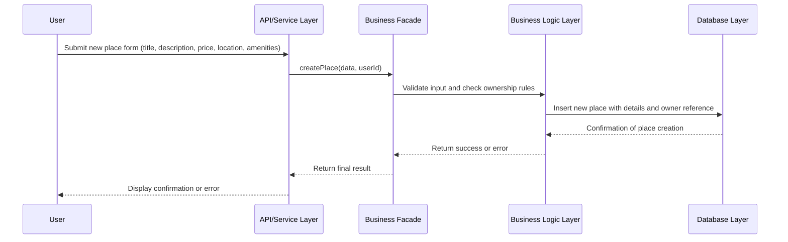

# Flux de création de propriété (Task 2 - Place Creation)

## Vue d'ensemble

Ce diagramme de séquence décrit le **processus complet de création d'une nouvelle propriété (Place)** dans le système HBNB, depuis la soumission du formulaire jusqu'à la sauvegarde en base de données.

## Diagramme



## Acteurs impliqués

```
User (Propriétaire)
    ↓
API Service Layer (Couche de Service API)
    ↓
Business Facade (Façade Métier)
    ↓
Business Logic Layer (Couche Logique Métier)
    ↓
Database Layer (Couche Base de Données)
```

## Données d'entrée

L'utilisateur (propriétaire) soumet un formulaire avec :

```json
{
  "title": "Appartement cosy à Paris",
  "description": "Petit studio en plein cœur du 5ème arrondissement",
  "price": 85.50,
  "location": {
    "latitude": 48.8566,
    "longitude": 2.3522
  },
  "amenities": [
    "WiFi",
    "Climatisation",
    "Cuisine équipée"
  ]
}
```

---

## Étapes du processus

### 1️⃣ Soumission du formulaire
```
User → API Service Layer
```
Le propriétaire remplit le formulaire et clique sur "Créer une propriété".

### 2️⃣ Réception par l'API
```
API Service Layer → Business Facade
Action : createPlace(data, userId)
```
L'API reçoit les données et le user_id et les transmet à la façade métier.

### 3️⃣ Validation et vérification des règles métier
```
Business Facade → Business Logic Layer
Vérifications :
  ✓ Titre non vide et valide
  ✓ Prix > 0
  ✓ Coordonnées GPS valides
  ✓ Vérifier les droits du propriétaire (ownership rules)
```
La logique métier effectue les validations selon les règles du domaine.

**Règles métier à respecter** :
- ✅ Seul le propriétaire peut créer une propriété
- ✅ Le titre est obligatoire et unique (ou pas de doublons)
- ✅ Le prix doit être positif
- ✅ Les coordonnées GPS doivent être valides
- ✅ Les commodités doivent exister dans le système

### 4️⃣ Insertion en base de données
```
Business Logic Layer → Database Layer
Données à insérer :
  • Générer un UUID unique
  • Ajouter le titre
  • Ajouter la description
  • Ajouter le prix
  • Ajouter la localisation (latitude, longitude)
  • Ajouter le owner_id (référence à l'utilisateur)
  • Générer created_at et updated_at
  • Lier les commodités
```

### 5️⃣ Confirmation de création
```
Database Layer → Business Logic Layer
Réponse : "Place créée avec succès"
Retour : {
  id: "uuid-1234-5678",
  title: "Appartement cosy à Paris",
  owner_id: "uuid-user-1234",
  created_at: "2026-02-11T10:30:00Z"
}
```

### 6️⃣ Retour à la façade métier
```
Business Logic Layer → Business Facade
Réponse : success ou error
```

### 7️⃣ Réponse de l'API
```
Business Facade → API Service Layer
Données retournées au client
```

### 8️⃣ Affichage au propriétaire
```
API Service Layer → User
Affichage : 
  ✅ "Votre propriété a été créée avec succès !"
  📍 ID: uuid-1234-5678
  🏠 Titre: "Appartement cosy à Paris"
```

---

## Flux complet visualisé

```
Propriétaire remplit le formulaire
        ↓
Soumet les données
        ↓
API reçoit et transmet à la Façade
        ↓
Façade demande validation
        ↓
Logique Métier valide :
  • Titre valide ?
  • Prix valide ?
  • Coordonnées GPS valides ?
  • Utilisateur propriétaire validé ?
        ↓
Validation réussie
        ↓
Insertion en base de données :
  • Générer UUID
  • Créer l'enregistrement
  • Lier les commodités
        ↓
Confirmation de création
        ↓
Réponse retournée à l'API
        ↓
Affichage au propriétaire
```

---

## Gestion des erreurs

### Cas d'erreur possibles

| Erreur | Cause | Message |
|--------|-------|---------|
| **Titre vide** | Champ obligatoire | "Le titre de la propriété est obligatoire" |
| **Prix invalide** | Valeur négative ou nulle | "Le prix doit être supérieur à 0" |
| **Coordonnées invalides** | GPS hors limites | "Les coordonnées GPS sont invalides" |
| **Utilisateur non autorisé** | Pas propriétaire | "Seul le propriétaire peut créer une propriété" |
| **Commodité inexistante** | Référence invalide | "Une ou plusieurs commodités n'existent pas" |
| **Erreur BD** | Problème technique | "Erreur lors de la création - Réessayez" |

---

## Attributs d'une Place créée

Après création, une Place aura :

```
Place {
  id: UUID                    // Identifiant unique généré
  title: string              // Titre fourni
  description: string        // Description fournie
  price: float              // Prix fourni
  latitude: float           // Latitude fournie
  longitude: float          // Longitude fournie
  owner_id: UUID            // Référence au propriétaire
  created_at: datetime      // Date/heure de création
  updated_at: datetime      // Dernière modification
  amenities: [              // Commodités associées
    Amenity1,
    Amenity2,
    ...
  ]
}
```

---

## Exemple concret

```
Propriétaire: "Je veux créer une propriété"
              Titre: "Studio moderne à Marseille"
              Prix: 75€/nuit
              Localisation: 43.2965°N, 5.3698°E
              Commodités: WiFi, Parking, TV

API: "J'ai reçu les données du propriétaire"

Façade: "Vérification en cours..."

Logique Métier: 
  ✓ Titre valide ? Oui
  ✓ Prix valide ? Oui (75 > 0)
  ✓ Coordonnées valides ? Oui
  ✓ Utilisateur propriétaire ? Oui

BD: "Création de la propriété..."
    ID généré: 5f8a9b3c-1234-5678
    Propriété créée avec succès

Réponse: "Votre propriété a été créée !
         ID: 5f8a9b3c-1234-5678
         Vous pouvez maintenant la gérer."
```

---

## Relations créées

Après la création :
```
User (Propriétaire) 
  ├── owns → Place (nouvelle)
  └── Place peut avoir → Amenities
      Place peut recevoir → Reviews
```
