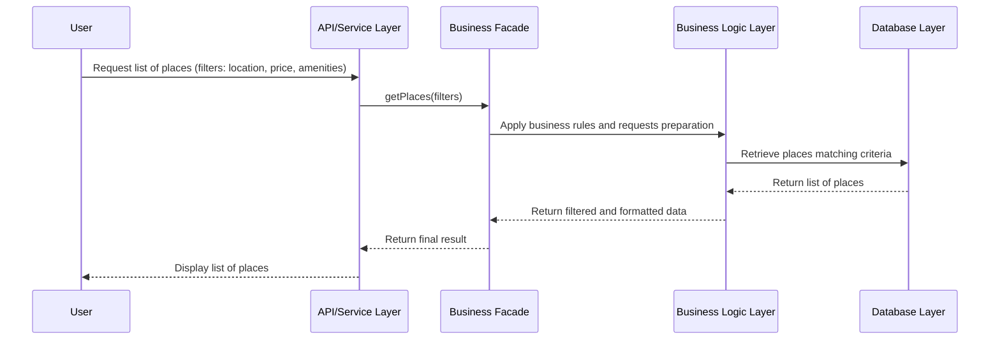

# Flux de consultation des propriétés (Task 2 - List of Places)

## Vue d'ensemble

Ce diagramme de séquence illustre le **processus de récupération et affichage d'une liste de propriétés filtrées**, permettant aux utilisateurs de rechercher des logements selon leurs critères.

## Diagramme



## Acteurs impliqués

```
User (Visiteur/Locataire)
    ↓
API Service Layer (Couche de Service API)
    ↓
Business Facade (Façade Métier)
    ↓
Business Logic Layer (Couche Logique Métier)
    ↓
Database Layer (Couche Base de Données)
```

## Données d'entrée - Critères de recherche

L'utilisateur peut filtrer par :

```json
{
  "location": "Paris",           // Localisation
  "price_min": 50,              // Prix minimum
  "price_max": 200,             // Prix maximum
  "amenities": [                // Commodités requises
    "WiFi",
    "Piscine",
    "Ascenseur"
  ],
  "rating_min": 4.0,            // Note minimale
  "check_in": "2026-02-15",     // Date d'arrivée
  "check_out": "2026-02-20"     // Date de départ
}
```

---

## Étapes du processus

### 1️⃣ Requête de l'utilisateur
```
User → API Service Layer
```
L'utilisateur soumet les critères de recherche (certains facultatifs).

### 2️⃣ Réception par l'API
```
API Service Layer → Business Facade
Action : getPlaces(filters)
```
L'API reçoit les critères et les transmet à la façade métier.

### 3️⃣ Application des règles métier
```
Business Facade → Business Logic Layer
Actions :
  • Préparer les critères de recherche
  • Appliquer les règles de filtrage
  • Gérer la pagination (ex: 10 résultats par page)
  • Trier par pertinence
```

**Règles appliquées** :
- ✅ Filtrer par gamme de prix
- ✅ Filtrer par localisation (rayon géographique)
- ✅ Filtrer par commodités disponibles
- ✅ Exclure les propriétés indisponibles
- ✅ Filtrer par note minimale
- ✅ Vérifier la disponibilité aux dates demandées
- ✅ Appliquer la pagination pour les performances

### 4️⃣ Requête à la base de données
```
Business Logic Layer → Database Layer
Requête : SELECT places WHERE
  location LIKE '%Paris%'
  AND price BETWEEN 50 AND 200
  AND amenities CONTAINS ['WiFi', 'Piscine']
  AND rating >= 4.0
  AND is_available = true
```

La base de données effectue la recherche avec tous les filtres.

### 5️⃣ Retour des résultats
```
Database Layer → Business Logic Layer
Réponse : Liste de 15 propriétés correspondantes
```

Retourne les données brutes de la BD.

### 6️⃣ Formatage des données
```
Business Logic Layer → Business Logic Layer (traitement interne)
Transformations :
  • Ajouter les images
  • Calculer la distance
  • Formater les prix (devise)
  • Ajouter les avis récents
  • Enrichir avec données de localisation
```

### 7️⃣ Retour à la façade
```
Business Logic Layer → Business Facade
Données formatées et triées
```

### 8️⃣ Réponse de l'API
```
Business Facade → API Service Layer
JSON formaté avec les propriétés
```

### 9️⃣ Affichage au visiteur
```
API Service Layer → User
Affichage :
  - Liste de 15 propriétés
  - Images, prix, localisation
  - Avis et notes moyennes
  - Boutons de réservation
```

---

## Flux complet visualisé

```
Utilisateur saisit les filtres
        ↓
Clique sur "Rechercher"
        ↓
API reçoit les critères
        ↓
Transmet à la Façade
        ↓
Façade prépare la recherche
        ↓
Logique Métier applique les règles :
  • Valider les critères
  • Préparer la requête
  • Gérer la pagination
        ↓
Requête à la base de données
        ↓
BD récupère les propriétés correspondantes
        ↓
Résultats retournés
        ↓
Formatage et enrichissement des données
        ↓
Tri par pertinence/prix/avis
        ↓
Réponse retournée à la Façade
        ↓
API prépare le JSON final
        ↓
Affichage au visiteur
```

---

## Gestion des filtres

### Filtres disponibles

| Filtre | Type | Description |
|--------|------|-------------|
| **location** | string | Localisation (ville, code postal, quartier) |
| **price_min** | float | Prix minimum par nuit |
| **price_max** | float | Prix maximum par nuit |
| **amenities** | array | Commodités requises (WiFi, Piscine, etc.) |
| **rating_min** | float | Note minimale (0-5) |
| **check_in** | date | Date d'arrivée |
| **check_out** | date | Date de départ |
| **host_id** | UUID | Propriétaire spécifique |
| **room_type** | enum | Type de logement (studio, 1BR, etc.) |

### Filtres optionnels

Tous les filtres sont **optionnels** :
- ✅ Recherche sans filtre = affiche toutes les propriétés
- ✅ Recherche partielle = combine les filtres fournis

---

## Gestion des erreurs

### Cas d'erreur possibles

| Erreur | Cause | Comportement |
|--------|-------|--------------|
| **Aucun résultat** | Aucune propriété ne correspond | "Aucune propriété ne correspond à vos critères" |
| **Filtres invalides** | Format incorrect | "Vérifiez vos critères de recherche" |
| **Erreur BD** | Problème technique | "Erreur de recherche - Réessayez" |
| **Timeout** | Recherche trop longue | "La recherche a pris trop de temps" |

---

## Structure de réponse

```json
{
  "status": "success",
  "total_results": 15,
  "page": 1,
  "per_page": 10,
  "total_pages": 2,
  "places": [
    {
      "id": "uuid-1234",
      "title": "Appartement cosy à Paris",
      "price": 85.50,
      "location": {
        "address": "5ème arrondissement, Paris",
        "latitude": 48.8566,
        "longitude": 2.3522,
        "distance_km": 2.3
      },
      "rating": 4.7,
      "reviews_count": 24,
      "amenities": ["WiFi", "Ascenseur", "Parking"],
      "owner": {
        "id": "uuid-user",
        "name": "Jean Dupont"
      },
      "image_url": "https://..."
    },
    // ... autres propriétés
  ]
}
```

---

## Exemple concret

```
Utilisateur: "Je cherche une propriété à Paris
              Entre 50 et 150€/nuit
              Avec WiFi et Piscine"

API: "Critères reçus :
      location=Paris, price_min=50, price_max=150,
      amenities=[WiFi, Piscine]"

Façade: "Préparation de la recherche..."

Logique Métier:
  ✓ Valider les critères
  ✓ Préparer la requête filtrée
  ✓ Configurer la pagination (10 par page)
  ✓ Déterminer le tri (pertinence)

BD: "Recherche dans les propriétés...
     Filtre 1: location LIKE 'Paris'
     Filtre 2: price BETWEEN 50 AND 150
     Filtre 3: 'WiFi' IN amenities
     Filtre 4: 'Piscine' IN amenities
     Résultat: 47 propriétés trouvées"

Formatage:
  • Ajouter images et avis
  • Calculer les distances
  • Trier par note (meilleur d'abord)
  • Paginer (afficher 10 sur 47)

Réponse: "Affichage de 10 propriétés sur 47
         - Studio Paris 5ème - 85€/nuit - 4.8★
         - Apt 1BR Paris 6ème - 120€/nuit - 4.6★
         ... (8 autres propriétés)
         
         Page 1/5 [Suivant →]"
```

---

## Performance

🚀 **Optimisations** :
- ✅ **Pagination** : Limite le nombre de résultats affichés
- ✅ **Index BD** : Indexe les colonnes de filtrage
- ✅ **Cache** : Mémorise les recherches courantes
- ✅ **Tri côté BD** : Utilise les capacités du moteur BD
