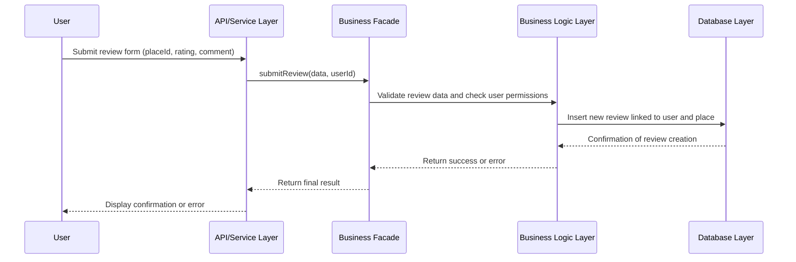

# Flux de création d'avis (Task 2 - Create Review)

## Vue d'ensemble

Ce diagramme de séquence décrit le **processus complet de création et soumission d'un avis** sur une propriété, permettant aux locataires d'évaluer leur expérience.

## Diagramme



## Acteurs impliqués

```
User (Locataire)
    ↓
API Service Layer (Couche de Service API)
    ↓
Business Facade (Façade Métier)
    ↓
Business Logic Layer (Couche Logique Métier)
    ↓
Database Layer (Couche Base de Données)
```

## Données d'entrée

Le locataire soumet un formulaire d'avis :

```json
{
  "place_id": "uuid-place-5678",
  "rating": 5,
  "comment": "Propriété magnifique ! Très bien entretenue, 
             accueil chaleureux du propriétaire. Je recommande !",
  "aspects": {
    "cleanliness": 5,
    "communication": 4,
    "location": 5,
    "value_for_money": 4
  }
}
```

---

## Étapes du processus

### 1️⃣ Soumission du formulaire d'avis
```
User → API Service Layer
```
Le locataire remplit le formulaire d'avis (commentaire + note) et le soumet.

### 2️⃣ Réception par l'API
```
API Service Layer → Business Facade
Action : submitReview(data, userId)
```
L'API reçoit les données et le user_id et les transmet à la façade métier.

### 3️⃣ Validation et vérification des permissions
```
Business Facade → Business Logic Layer
Vérifications :
  ✓ L'utilisateur a-t-il loué cette propriété ?
  ✓ La note est-elle valide (1-5) ?
  ✓ Le commentaire n'est-il pas vide ?
  ✓ L'utilisateur n'a-t-il pas déjà écrit un avis ?
  ✓ Le séjour est-il complété ?
```

**Règles métier à respecter** :
- ✅ Seul un locataire qui a séjourné peut écrire un avis
- ✅ Un avis par réservation maximum
- ✅ Note entre 1 et 5
- ✅ Commentaire entre 10 et 500 caractères (exemple)
- ✅ L'avis ne peut être créé qu'après le départ
- ✅ Délai limite pour écrire l'avis (ex: 30 jours)

### 4️⃣ Insertion en base de données
```
Business Logic Layer → Database Layer
Données à insérer :
  • Générer un UUID unique pour l'avis
  • Ajouter la note (rating)
  • Ajouter le commentaire
  • Ajouter la référence à la propriété (place_id)
  • Ajouter la référence à l'utilisateur (user_id)
  • Générer created_at et updated_at
  • Enregistrer les évaluations détaillées (optionnel)
  • Marquer la réservation comme ayant un avis
```

**Données créées** :
```sql
INSERT INTO reviews (
  id,
  place_id,
  user_id,
  rating,
  comment,
  created_at,
  updated_at
) VALUES (
  'uuid-review-1234',
  'uuid-place-5678',
  'uuid-user-alice',
  5,
  'Propriété magnifique !',
  '2026-02-11T15:30:00Z',
  '2026-02-11T15:30:00Z'
)
```

### 5️⃣ Confirmation de création
```
Database Layer → Business Logic Layer
Réponse : "Avis créé avec succès"
Retour : {
  id: "uuid-review-1234",
  place_id: "uuid-place-5678",
  user_id: "uuid-user-alice",
  rating: 5,
  created_at: "2026-02-11T15:30:00Z"
}
```

### 6️⃣ Mise à jour des statistiques
```
Business Logic Layer → Business Logic Layer (traitement interne)
Calculs :
  • Nouvelle note moyenne de la propriété
  • Nombre total d'avis
  • Distribution des notes (% 5★, % 4★, etc.)
  • Tendance (amélioration/dégradation)
```

### 7️⃣ Retour à la façade métier
```
Business Logic Layer → Business Facade
Réponse : success ou error
Données enrichies avec les statistiques
```

### 8️⃣ Réponse de l'API
```
Business Facade → API Service Layer
JSON formaté avec confirmation
```

### 9️⃣ Affichage au locataire
```
API Service Layer → User
Affichage : 
  ✅ "Votre avis a été publié avec succès !"
  📊 Nouvelle note moyenne: 4.8/5 (24 avis)
  ⭐ Votre avis: "Propriété magnifique !..." (5★)
```

---

## Flux complet visualisé

```
Locataire complète son séjour
        ↓
Remplit le formulaire d'avis
        ↓
Note: 5 étoiles
Commentaire: "Excellent séjour..."
        ↓
Soumet le formulaire
        ↓
API reçoit et transmet à la Façade
        ↓
Façade demande validation
        ↓
Logique Métier vérifie :
  ✓ L'utilisateur a-t-il loué ?
  ✓ La note est-elle valide (1-5) ?
  ✓ Le commentaire est-il valide ?
  ✓ Pas d'avis double ?
  ✓ Délai respecté ?
        ↓
Validation réussie
        ↓
Insertion en base de données :
  • Créer l'avis
  • Mettre à jour les statistiques
        ↓
Mise à jour de la note moyenne
        ↓
Confirmation retournée
        ↓
Réponse finalisée par Façade
        ↓
API renvoie le résultat
        ↓
Affichage au locataire
```

---

## Gestion des erreurs

### Cas d'erreur possibles

| Erreur | Cause | Message |
|--------|-------|---------|
| **Utilisateur non autorisé** | Pas de réservation | "Vous devez avoir loué cette propriété" |
| **Avis déjà existant** | Double soumission | "Vous avez déjà écrit un avis pour cette propriété" |
| **Note invalide** | Valeur hors limites | "La note doit être entre 1 et 5" |
| **Commentaire vide** | Champ obligatoire | "Le commentaire est obligatoire" |
| **Commentaire trop court** | Minimum non atteint | "Le commentaire doit contenir au moins 10 caractères" |
| **Commentaire trop long** | Dépassement de limite | "Le commentaire ne peut pas dépasser 500 caractères" |
| **Délai dépassé** | Avis trop tardif | "Vous pouvez écrire un avis jusqu'à 30 jours après votre séjour" |
| **Propriété inexistante** | ID invalide | "Cette propriété n'existe pas" |
| **Erreur BD** | Problème technique | "Erreur lors de la publication - Réessayez" |

---

## Attributs d'une Review créée

Après création, une Review aura :

```
Review {
  id: UUID                    // Identifiant unique généré
  place_id: UUID             // Référence à la propriété
  user_id: UUID              // Référence au locataire
  rating: int (1-5)          // Note fournie
  comment: string            // Commentaire fourni
  created_at: datetime       // Date de création
  updated_at: datetime       // Dernière modification
  is_verified: bool          // Avis vérifié (utilisateur a vraiment loué)
  helpful_count: int         // Nombre de personnes trouvant ça utile
}
```

---

## Impact sur les données

### Mise à jour de la propriété

```
Place {
  id: uuid-place-5678,
  title: "Appartement cosy",
  ...
  reviews_count: 24,         // +1
  average_rating: 4.82,      // Recalculé
  rating_distribution: {
    5: 15,  // 62%
    4: 7,   // 29%
    3: 2,   // 8%
    2: 0,
    1: 0
  },
  recent_reviews: [
    {
      id: "uuid-review-1234",
      author: "Alice",
      rating: 5,
      comment: "Propriété magnifique !",
      date: "2026-02-11"
    },
    // ... autres avis récents
  ]
}
```

---

## Exemple concret

```
Locataire: "J'ai fini mon séjour, je veux laisser un avis"

Formulaire:
  - Note: ⭐⭐⭐⭐⭐ (5 sur 5)
  - Commentaire: "Appartement magnifique, très bien entretenu.
                  Le propriétaire était disponible et sympathique.
                  Je recommande vivement !"

API: "J'ai reçu l'avis pour la propriété uuid-place-5678
     de la part de l'utilisateur alice"

Façade: "Vérification des permissions..."

Logique Métier:
  ✓ Alice a-t-elle loué uuid-place-5678 ? OUI
  ✓ Son séjour est-il complété ? OUI
  ✓ A-t-elle déjà écrit un avis ? NON
  ✓ La note est-elle valide ? OUI (5)
  ✓ Le commentaire est-il valide ? OUI (>10 caractères)
  ✓ Délai respecté ? OUI (2 jours après départ)

BD: "Création de l'avis...
     INSERT INTO reviews (...)
     Avis créé : uuid-review-1234"

Mise à jour statistiques:
  - Nombre d'avis: 23 → 24
  - Note moyenne: 4.79 → 4.82
  - Distribution: 5★ passe de 14 à 15

Réponse: "✅ Votre avis a été publié !
         La note moyenne est maintenant 4.82/5 (24 avis)
         Votre avis nous aide à nous améliorer."
```

---

## Affichage public des avis

Les avis sont affichés sur la page de la propriété :

```
📍 Propriété: Appartement cosy à Paris

⭐⭐⭐⭐⭐ 4.82/5 (24 avis)

Avis récent:
  Par Alice, le 11/02/2026 (⭐⭐⭐⭐⭐)
  "Propriété magnifique, très bien entretenue.
   Le propriétaire était disponible et sympathique.
   Je recommande vivement !"
   👍 12 personnes ont trouvé ça utile

Distribution des notes:
  ⭐⭐⭐⭐⭐ (15 avis - 62%)
  ⭐⭐⭐⭐  (7 avis - 29%)
  ⭐⭐⭐    (2 avis - 8%)
```
