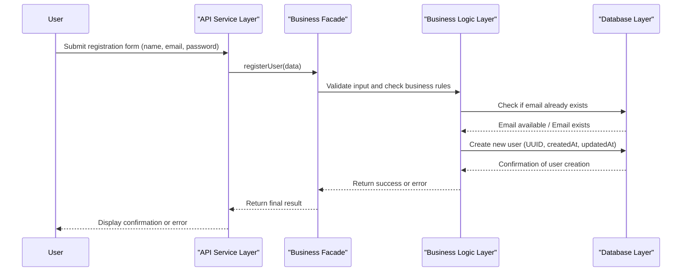

# Flux d'enregistrement utilisateur (Task 2 - User Subscription)

## Vue d'ensemble

Ce diagramme de séquence illustre le **processus complet d'inscription d'un nouvel utilisateur** dans le système HBNB, du formulaire à la création de compte.

## Diagramme



## Acteurs impliqués

```
User (Utilisateur)
    ↓
API Service Layer (Couche de Service API)
    ↓
Business Facade (Façade Métier)
    ↓
Business Logic Layer (Couche Logique Métier)
    ↓
Database Layer (Couche Base de Données)
```

## Étapes du processus

### 1️⃣ Soumission du formulaire
```
User → API Service Layer
Données : {
  name: "Jean Dupont",
  email: "jean@example.com",
  password: "secure_password123"
}
```
L'utilisateur remplit et soumet le formulaire d'inscription.

### 2️⃣ Réception par l'API
```
API Service Layer → Business Facade
Action : registerUser(data)
```
L'API reçoit les données et les transmet à la façade métier.

### 3️⃣ Validation des données
```
Business Facade → Business Logic Layer
Vérifications :
  ✓ Format email valide
  ✓ Mot de passe assez fort
  ✓ Données obligatoires présentes
```
La logique métier valide toutes les entrées selon les règles définies.

### 4️⃣ Vérification d'unicité de l'email
```
Business Logic Layer → Database Layer
Requête : "L'email existe-t-il déjà ?"
```
Vérifie que l'email n'est pas déjà utilisé (contrainte d'unicité).

**Réponse possible** :
- ✅ Email disponible → Continuer
- ❌ Email exists → Retourner une erreur

### 5️⃣ Création du nouvel utilisateur
```
Business Logic Layer → Database Layer
Actions :
  • Générer un UUID unique
  • Hasher le mot de passe
  • Enregistrer : (UUID, email, password_hash, createdAt, updatedAt)
```
La base de données crée l'enregistrement utilisateur avec un identifiant unique.

### 6️⃣ Confirmation de création
```
Database Layer → Business Logic Layer
Réponse : "Utilisateur créé avec succès"
```
La base de données confirme la création et retourne les détails.

### 7️⃣ Retour au niveau métier
```
Business Logic Layer → Business Facade
Réponse : success ou error
```
La logique métier transmet le résultat à la façade.

### 8️⃣ Réponse de l'API
```
Business Facade → API Service Layer
Résultat final : {
  status: "success",
  user_id: "uuid-xxxx-xxxx",
  message: "Inscription réussie"
}
```
L'API prépare la réponse au client.

### 9️⃣ Affichage du résultat à l'utilisateur
```
API Service Layer → User
Affichage : 
  ✅ "Bienvenue ! Votre compte a été créé."
  ou
  ❌ "Erreur : Cet email est déjà utilisé."
```
L'utilisateur reçoit un message de confirmation ou d'erreur.

---

## Flux complet visualisé

```
User remplit le formulaire
        ↓
Soumet les données
        ↓
API reçoit et transmet à la Façade
        ↓
Façade demande validation
        ↓
Logique Métier valide les données
        ↓
Vérification de l'email en BD
        ↓
Si email libre :
    └─→ Création de l'utilisateur
        ↓
        Confirmation retournée
        ↓
Si email existe :
    └─→ Erreur retournée
        ↓
        Réponse finalisée par Façade
        ↓
API renvoie le résultat
        ↓
Affichage à l'utilisateur
```

---

## Gestion des erreurs

### Cas d'erreur possibles

| Erreur | Cause | Message |
|--------|-------|---------|
| **Email invalide** | Format incorrect | "Veuillez entrer un email valide" |
| **Email déjà utilisé** | Utilisateur existant | "Cet email est déjà enregistré" |
| **Mot de passe faible** | Pas assez de caractères | "Le mot de passe doit contenir au moins 8 caractères" |
| **Données manquantes** | Champs vides | "Tous les champs sont obligatoires" |
| **Erreur BD** | Problème technique | "Erreur serveur - Réessayez plus tard" |

---

## Sécurité

🔒 **Points importants** :
- ✅ Le mot de passe est **hashé** avant stockage (pas en clair)
- ✅ L'email est **vérifié** pour l'unicité
- ✅ Un **UUID unique** est généré pour chaque utilisateur
- ✅ Les **timestamps** (created_at, updated_at) sont enregistrés
- ✅ Les données sont **validées** à chaque étape

---

## Exemple concret

```
User: "Je veux m'inscrire"
      Nom: Alice Leblanc
      Email: alice@email.com
      Mot de passe: AlicePassword123!

API: "J'ai reçu : alice@email.com"

Façade: "Vérification de alice@email.com..."

Logique Métier: "Email valide ? ✓
                 Mot de passe fort ? ✓
                 Je vérifierai à la BD..."

BD: "alice@email.com existe ? Non ✓
     Je crée l'utilisateur..."

Réponse: "Bienvenue Alice ! Votre compte est créé."
```
