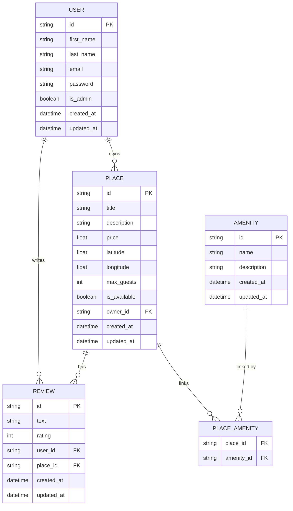

# HBnB — Entity-Relationship Diagram

This diagram represents the database schema for the HBnB project.
It was generated using [Mermaid.js](https://mermaid.js.org/) and reflects the SQLAlchemy models defined in `app/models/`.

---

---

## Relationships

| Relationship | Type | Description |
|---|---|---|
| USER → PLACE | One-to-Many | A user can own multiple places |
| USER → REVIEW | One-to-Many | A user can write multiple reviews |
| PLACE → REVIEW | One-to-Many | A place can have multiple reviews |
| PLACE ↔ AMENITY | Many-to-Many | A place can have multiple amenities, an amenity can belong to multiple places (via `PLACE_AMENITY`) |
